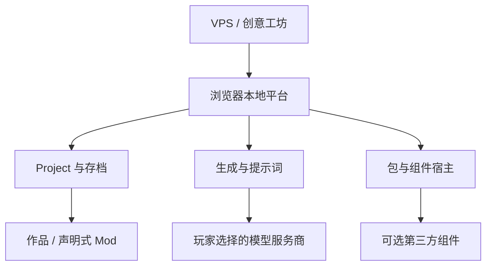
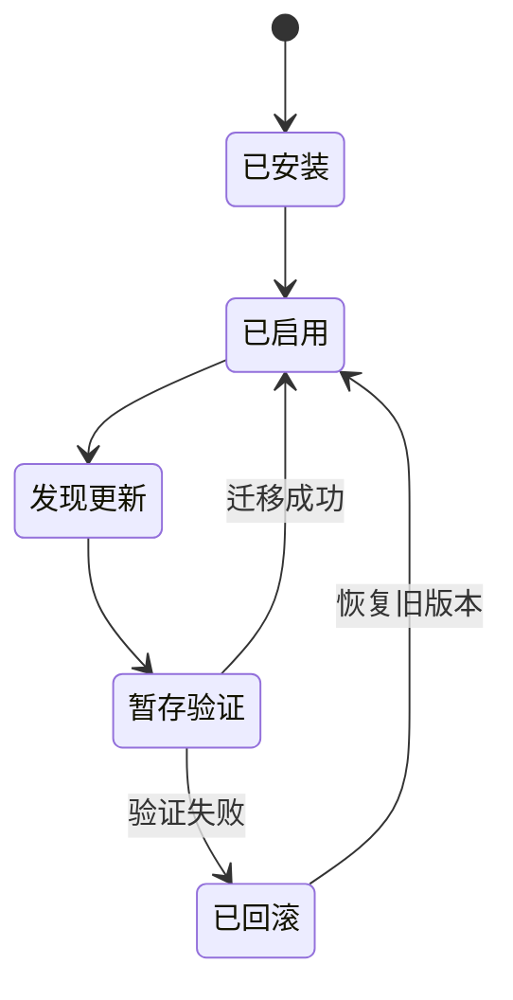

# 独立前端开发平台设计案

> 版本：platform-proposal-v0.1
> 日期：2026-08-14
> 状态：**独立预研案 / 候选技术路线 / 非开发承诺**
> 与《修仙军工》的关系：潜在消费者之一，尚未决定采用；本文件不属于该卡设定正典，也不修改其当前实现计划。

## 0. 当前结论

1. 建设方向是一个 **浏览器本地优先的独立前端开放平台**，而不是继续依赖 SillyTavern，也不是重写一份 SillyTavern。
2. 平台可以在未来承载不同角色卡 / Project、多个本地存档、声明式 Mod、媒体资源和编辑工具；但首版只验证最小运行闭环，不一次性建设完整生态。
3. 《关于我穿越修仙世界搞军工这件事》只是潜在的首个试验项目，**不保证直接采用本方案，也不因平台预研而改变当前卡路线**。
4. 即使《修仙军工》采用独立前端，初版也 **不内置、不预装、不自动下载、不强依赖当前讨论中的 SP 数据库**。这里不影响平台使用 IndexedDB / OPFS 等普通本地存储。
5. SP 数据库、MVU / Zod、酒馆助手及其配套资源均是有作者、有上游、有版本生命周期的第三方组件。平台只能提供中立宿主能力与接入机制，不能将其业务实现吞并、换名或冒充平台核心。
6. MVU / Zod、酒馆助手是否作为首批可选组件接入尚未裁定；无论何时接入，都不能成为平台内核或 MVP 的强依赖。

本设计案可以独立演化。《修仙军工》是否采用、何时采用、采用到什么程度，必须在平台最小原型验证后另行裁定。

---

## 1. 项目定位

### 1.1 产品定义

平台是一套可缓存到浏览器并在玩家本机运行的角色卡 / LLM 互动作品前端底座：

- 每张卡以独立 **Project Pack** 存在，可拥有完全不同的页面、交互、玩法和视觉；
- 平台提供通用的模型连接、提示词拼装、本地存档、资源加载和包生命周期；
- 玩家可在未来安装地图、角色、宗门设施、灵宠、坐骑、武器、Builder、图片、GIF 等 Mod；
- 创意工坊负责公开内容的索引、版本信息与分发，不持有玩家 API Key、模型请求或私人存档；
- 电脑与手机之间通过 JSON / ZIP 导入导出存档与内容包，首版不建设云同步。

### 1.2 为什么值得预研

- 独立前端不受酒馆 DOM、聊天楼层和扩展注入方式限制，可以按作品需要自由设计游戏化界面；
- Prompt、Provider、Save、Project 等通用能力可以复用到其他卡，不再为每张卡重复造壳；
- 平台、作品、第三方组件与社区 Mod 可以分别发版，降低一处更新牵动全部内容的风险；
- 先把多 Project 与存档身份规划进去，未来迁移其他卡时不必推翻底层数据结构。

### 1.3 非目标

- 不以兼容 SillyTavern 全部功能或插件生态为目标；
- 不复制 SillyTavern、酒馆助手、SP 数据库、MVU / Zod 的源码、UI、提示词或内部语义；
- 不建设平台统一的仙侠变量模型，不把《修仙军工》的境界、地图或角色结构写进通用内核；
- 不在首版同时完成游戏、平台、完整工坊、全部编辑器、第三方兼容层与可执行插件沙箱；
- 不提供云 API Key、云存档、模型代理、多人在线或账号强绑定；
- 不承诺浏览器能够直连所有模型服务商或任意 OpenAI-compatible 地址。

---

## 2. 与《修仙军工》的隔离边界

### 2.1 事实源分离

| 对象 | 权威来源 | 不得承担的职责 |
|---|---|---|
| 《修仙军工》设定与玩法 | 当前仓库的 `plan.md`、审批稿和归档纪要 | 不定义平台通用能力 |
| 独立前端平台 | 本目录及未来独立平台仓库 | 不决定《修仙军工》正典 |
| Project Pack | 对应作品自己的 manifest、前端和规则包 | 不修改平台内核 |
| 第三方组件 | 原作者仓库、发行物与文档 | 不被平台重新认领 |
| 社区 Mod | Mod 作者的包与版本记录 | 不成为作品基础包事实源 |

### 2.2 采用关系

- 《修仙军工》可以继续采用更轻的角色卡或独立页面方案；
- 可以只借用平台的一部分能力，例如 Provider、Prompt、Save，而不使用组件系统；
- 可以在后续版本迁移，也可以始终不迁移；
- 平台研发进度不得阻塞《修仙军工》的设定、角色卡初版或其他发行路线；
- 平台验证应优先使用中立 Demo，不以《修仙军工》的专属 schema 伪装成通用平台设计。

---

## 3. 总体架构



数据流必须保持三路分离：

1. **VPS → 浏览器**：静态 PWA、Project / Mod / 组件元数据、公开媒体与下载包；
2. **浏览器 ↔ 模型服务商**：玩家 Prompt、API Key 与模型响应，直接通信；
3. **浏览器本地**：存档、已安装包、设置、缓存和可选的本地凭据保险箱。

正常受信发行物的数据流中，平台 VPS 不接触第二、第三路的私人内容。由于 PWA 和 Service Worker 本身仍由 VPS 发布，平台部署账号或构建供应链被攻陷时，恶意新版理论上可能读取玩家已解锁的数据；因此还需要不可变版本、构件哈希 / 签名、可审计构建、明确更新提示、严格 `connect-src` 与默认无第三方遥测。不能将“业务请求不经过 VPS”宣传成“VPS 被攻陷也绝对无法影响本地数据”。

---

## 4. 平台自有能力边界

### 4.1 目标平台内核职责

平台只拥有中立、可跨作品复用的原语：

- **App / Project 生命周期**：安装、启用、停用、升级、打开与关闭 Project；
- **会话与生成管线**：消息历史、生成请求、流式响应、取消和错误归一；
- **Prompt Compiler**：有序提示块、槽位、宏、触发条件、Token 预算与最终 Prompt Inspector；
- **Provider Registry**：服务商协议适配、Endpoint、模型、采样预设和连接方案；
- **Local Credential Vault**：只在浏览器本地管理 Secret，Project、Mod 和组件只引用 `credentialId`；
- **Save Envelope**：存档身份、Project 版本、消息、平台状态、组件锁与导入导出；
- **Package Host**：包清单、资源加载、版本锁、依赖信息、权限、数据命名空间和回滚槽位；
- **Capability API**：事件、提示贡献、生成请求、命名空间存储、UI 插槽和媒体调用。

Phase 1 MVP 只实现其中的 Project 加载、基础会话与生成、Prompt、Provider、本地凭据引用和 Save 子集。完整包依赖、组件权限、版本并存、数据迁移与回滚属于后续 Component Host 阶段，不能因写入目标架构而自动进入首版工期。

### 4.2 第一方内置模块

以下可以作为平台自己的界面或适配模块维护，但不必全部塞进最低层内核：

- 提示词管理器与最终请求检查器；
- Provider、模型、API Key、采样预设和连接方案管理器；
- SillyTavern Chat Completion 预设的单向导入器；
- Project 库、存档槽、备份恢复与导入导出界面；
- 工坊浏览、下载和已安装包管理界面。

格式兼容只代表读取公开导出格式，不代表复制原项目实现。

### 4.3 明确不属于平台核心

- 酒馆助手 / TavernHelper；
- SP 数据库；
- MVU、MagVarUpdate 及其 Zod 配套生态；
- 任意第三方状态栏、记忆、向量、剧情导演或 Agent 组件；
- 《修仙军工》变量树、世界书、地图、角色、战斗或构筑规则。

平台核心不得理解 SP 的表格语义或 MVU 的变量更新语义。第三方状态在平台存档中只能作为对应组件的独立、不透明命名空间存在。

---

## 5. Project、Mod、Component 与 Adapter

| 类型 | 定义 | 典型内容 | 是否可执行逻辑 |
|---|---|---|---|
| Project Pack | 一张完整作品或卡的运行包 | 前端、规则、Prompt、默认资源、兼容声明 | MVP 仅第一方内置 Project 可执行 |
| Mod | 对 Project 的内容扩展 | 地图、角色、设施、装备、灵宠、媒体、数据条目 | MVP 仅声明式 |
| Component | 原作者独立维护的功能软件包 | 数据库、MVU、状态框架、记忆或工具 | 后续受权限控制 |
| Adapter | 第三方组件与平台 Host API 的桥 | TavernHelper / ST 兼容映射、原生平台入口 | 独立版本与作者 |
| Resource Pack | 不改变规则的资源集合 | 图片、GIF、音频、主题、图标 | 否 |

这五类包分别拥有作者、版本、依赖、权限和更新记录，不能都被模糊地称为“Mod”。

MVP 中只有随平台固定构建、可审查并由平台发布者负责的第一方 Demo / Project 可以在应用代码域运行。外部 Project 的可执行前端与 Component 适用相同的版本、哈希、权限和隔离规则；沙箱完成前，外部 Project 只能使用声明式页面 / 数据能力。Project、Mod、Component 均不得直接访问 Credential Vault，只能通过能力桥调用 Generation Broker。

---

## 6. 第三方组件原则

### 6.1 归属原则

第三方组件必须保留：

- 原作者与发布者；
- 上游仓库与官方发布渠道；
- 上游原始版本 / tag、解析后的 commit 与构件哈希；
- 许可证或另行取得的再分发授权；
- Host API 兼容范围、依赖、权限、数据版本与迁移入口；
- Changelog、更新渠道、安装版本与可回滚版本。

平台不能将“主流方案”误写成“平台自研核心”。无明确再分发许可时，工坊只登记上游、提供安装入口或允许玩家本地导入，不镜像为平台资产。

### 6.2 SP 数据库核对记录

本轮用户提供的“数据库本体”实际是一个很薄的酒馆助手脚本加载器：

```js
import 'https://gcore.jsdelivr.net/gh/AlbusKen/shujuku@spv8.9.1/index.js'
```

- 上游仓库：<https://github.com/AlbusKen/shujuku>；
- 附件锁定版本：`spv8.9.1`；
- 当前附件的更新方法：作者发版后手动修改 `@` 后的 tag；
- 配套“三合一正则”包含显示、提示清理和远楼层隐藏等资源，但自身没有足够作者 / 来源元数据，接入时不能由平台替作者认领；
- 现有 SP 实现依赖 TavernHelper、SillyTavern 上下文、世界书、聊天消息和父窗口界面等大量宿主能力，不能在独立平台中直接原样加载并视为已完成兼容。

因此 SP 的正确定位是 **未来可选、可锁版本、可更新、可回滚的第三方 Component**。首版不安装它，也不为运行它而复制整套酒馆兼容环境。

### 6.3 更新生命周期



- 更新只提示，不随 PWA 更新静默替换；
- 每个发行物以固定 ref / commit / hash 缓存，不直接跟随 `latest`、`master` 等可变地址；
- 新旧版本允许并存，旧存档继续锁定旧版本；
- 升级存档前创建 checkpoint，在副本上执行迁移并验证；
- 权限增加、依赖变化或数据迁移都需要重新确认；
- 迁移失败恢复旧构件和更新前数据；
- 卸载默认只停用组件，不自动删除组件数据。

### 6.4 建议的组件清单

```json
{
  "componentId": "github:owner/repository",
  "kind": "state-framework",
  "ownership": {
    "author": "original-author",
    "publisher": "publisher-id",
    "source": "https://github.com/owner/repository",
    "license": "unverified"
  },
  "release": {
    "upstreamRef": "v1.0.0",
    "commit": "git-commit-sha",
    "artifact": "https://example.invalid/component.js",
    "integrity": "sha256-..."
  },
  "hostApiRange": "^1.0.0",
  "dependencies": [],
  "permissions": [],
  "storageSchemaVersion": 1,
  "updateChannel": "stable"
}
```

上游版本保留作者原始格式，不强迫所有作者采用 SemVer。平台另行保存可比较版本，仅用于兼容判断。

---

## 7. 纯浏览器运行与 API Key 边界

### 7.1 已确认的业务数据边界

- API Key 不经过创意工坊 VPS；
- 模型请求与响应不经过平台 VPS；
- Key 不进入 Project、存档、Mod、普通预设、平台持久化日志、导出物或工坊上传包；
- Project、Mod 和第三方组件永远不能读取 Secret 明文，只能经本地 Generation Broker 使用玩家选定的连接方案。

建议的首版实现是默认仅保存在当前浏览器会话内存；玩家明确选择“记住本机”时，再以用户口令派生密钥并将密文保存到 IndexedDB。JSON / ZIP 的普通导出始终排除 Credential Vault。这是安全设计工作假设，仍须原型验证，并非已经冻结的具体实现。

纯 Web 没有操作系统钥匙串。即使密文落盘，玩家解锁后，获得平台主页面执行权限的恶意代码仍可能窃取 Key。因此平台必须自托管依赖、禁止第三方脚本在主 Origin 执行、使用严格 CSP，并将可执行组件置于 Worker / sandbox iframe 与权限桥之后。

### 7.2 浏览器直连限制

PWA 缓存后依旧运行在平台 HTTPS Origin，不会变成 localhost，也不会绕过 CORS。平台只承诺维护“已验证可浏览器直连”的服务商 / Endpoint 列表：

- Adapter 应检测模型列表、生成、流式、取消与错误类型；
- 模型列表不可用时允许玩家手动填写模型名；
- 自定义 Endpoint 必须明确提示 CORS、安全与数据去向；
- 首版不以 VPS 反向代理绕过 CORS；
- 若未来大量服务商无法浏览器直连，再另行评估本地 companion 或桌面壳，而不是提前扩大 MVP。

---

## 8. 本地数据、多 Project 与存档

### 8.1 存储分工

- Service Worker Cache：PWA 外壳与公开静态资源；
- IndexedDB：Project 清单、设置、存档索引、结构化状态与小型 Blob；
- OPFS：大型媒体、组件构件、索引或需要文件语义的数据；
- JSON：不含大型媒体的存档与配置交换；
- ZIP：Project、Mod、组件、本地整包备份以及带图片 / GIF 的跨设备迁移。

SP / MVU 不内置并不等于平台没有本地存储。平台存储只负责保存与搬运数据，不取代第三方的剧情状态语义。

### 8.2 多 Project 预留

MVP 可以只发布一个官方 Project，但底层身份从第一天避免写死：

```json
{
  "projectId": "author.project-name",
  "projectVersion": "0.1.0",
  "engineVersion": "0.1.0",
  "saveSchemaVersion": 1,
  "saveId": "uuid",
  "slotName": "玩家自定义名称",
  "componentLocks": [],
  "modLocks": []
}
```

- 一个 Project 可有多个存档槽；
- 一个浏览器可安装多个 Project；
- Project 数据、存档和组件状态按 ID 隔离；
- 跨设备导入时优先恢复存档锁定的确切包版本；
- 找不到旧版本时只能提示“本地选择、迁移升级、只读打开或取消”，不能静默套用最新版。

---

## 9. MVP 范围

### 9.1 首版应实现

1. 可安装 / 可离线启动的 PWA 壳；
2. 中立 Project manifest 与一个 Demo / 官方 Project 的加载；
3. 浏览器本地 Provider、模型、API Key、采样预设和连接方案管理；
4. 基础 Prompt Manager、Prompt Compiler 与最终请求预览；
5. 一次完整的聊天 / 生成 / 流式输出 / 取消闭环；
6. 本地存档槽、自动保存、手动 checkpoint、JSON 导入导出；
7. 多 Project、多存档和包版本字段预留；
8. Mod manifest 与数据命名空间的向前兼容骨架，不要求 Phase 1 实现 Mod 安装运行；
9. Component manifest、权限和版本锁的设计占位，允许首版 **零第三方运行组件**。

### 9.2 首版明确不实现

- 内置、预装或自动安装 SP 数据库；
- 任意远程 JavaScript Mod；
- 完整组件依赖解析器、自动迁移市场和成熟沙箱；
- 地图、宗门、设施、角色、灵宠、坐骑、装备、Builder 的全部编辑器；
- 云存档、云 Key、推理中转、跨设备自动同步、多人在线；
- 成熟创意工坊的账号、评分、推荐、审核和商业化系统。

### 9.3 最小验收标准

- PWA 离线缓存后能启动并打开已安装 Project；
- 玩家可配置一个浏览器能够直连的模型服务商并完成流式生成；
- 全流程中 Key、Prompt、响应和存档均不经过平台 VPS；
- 同一存档导出后能在另一浏览器导入并得到一致状态；
- 平台升级后旧存档仍能打开，或明确进入可恢复的迁移流程；
- Mod / Component 的预留字段不会污染 Project 与存档基础数据；
- 不安装任何第三方运行组件时，MVP 的全部基础验收仍可完成。

MVU / Zod、酒馆助手是否在首批版本中提供为 **可选安装组件** 仍待决定；无论结果如何，它们都不是基础验收条件，也不能被平台内置为自身业务实现。

---

## 10. Mod 与编辑器演进

完整 Mod 编辑器是平台的后续价值，但按独立工具逐步建设：

1. 通用包编辑器：manifest、依赖、版本、权限与发布检查；
2. 资源管理器：图片、GIF、音频、图标、压缩、预览与引用；
3. 角色 / 物品编辑器：字段 schema、表单、预览和导入导出；
4. 地图 / 宗门 / 设施编辑器：图层、节点、区域、入口、媒体和数据绑定；
5. 灵宠、坐骑、武器、Builder 等领域编辑器；
6. 可执行 Component SDK、沙箱与调试工具。

编辑器输出的是版本化包，不直接修改玩家正在运行的正式存档。测试安装、发布审核和存档变更必须分离。

---

## 11. 风险与止损门槛

| 风险 | 当前控制方式 | 重开条件 |
|---|---|---|
| 平台、游戏、编辑器、工坊同时开工导致范围爆炸 | MVP 只做运行壳、Provider、Prompt、Save | 最小闭环稳定后逐项增加 |
| 浏览器 CORS 使部分服务商不可用 | 建立直连兼容表，不做 VPS Relay | 目标服务商覆盖率不足时评估本地 companion |
| 第三方远程代码与供应链攻击 | MVP 禁任意可执行 Mod；固定版本与哈希 | 沙箱、权限和更新回滚通过专项验收 |
| 平台构建或 Service Worker 供应链被篡改 | 不可变发行物、构件签名 / 哈希、可审计构建、更新提示、严格 CSP 与默认无遥测 | 发布链完成独立安全验收 |
| 浏览器存储被清理或移动端配额不足 | 持久化申请、配额提示、JSON / ZIP 正式备份 | 大型媒体压测失败时增加本地壳 |
| 第三方授权、署名与再分发不明确 | 只登记上游 / 本地导入，不默认镜像 | 获得作者许可或明确许可证后开放分发 |
| 旧酒馆脚本依赖大量非标准 API | 兼容层独立版本化，不污染 Host API | 确定具体组件且作者愿意协作接入 |
| 存档 schema 与组件依赖地狱 | 精确锁版本、checkpoint、迁移、回滚 | 多版本存档恢复测试通过后开放自动升级 |
| 通用平台被仙侠概念绑死 | 所有领域模型留在 Project / Mod | 用第二个不同题材 Project 做反向验证 |
| 大地图、GIF 与媒体拖垮移动端 | 资源预算、懒加载、分辨率层级后置验证 | 中低端移动设备基准测试通过后扩容 |

若最小 PWA 在目标移动设备上无法稳定运行、主流目标服务商无法浏览器直连，或多 Project 抽象明显拖慢首个作品交付，应暂停平台扩张，让《修仙军工》继续走更轻的独立实现。

---

## 12. 分阶段路线

### Phase 0：预研与边界

- 固定 Project、Save、Package、Component 的身份模型；
- 验证浏览器直连、PWA 离线、存储配额与移动端文件导入导出；
- 不编写 SP 兼容层；MVU / Zod、酒馆助手是否进入首批可选组件另行裁定。

### Phase 1：MVP 最小独立前端

- 单个 Demo / 官方 Project；
- Provider、Prompt、Generation、Save 闭环；
- 多 Project 和组件字段仅做向前兼容预留。

Phase 1 完成后即可单独进行一次《修仙军工》采用 Gate：只判断是否试用以及试用哪些平台能力，不承诺迁移，也不必等待完整组件生态、编辑器和工坊完成。

### Phase 2：Project 与存档管理

- 多 Project 安装、启停与升级；
- 多存档槽、checkpoint、JSON / ZIP 备份恢复；
- 基础声明式资源 / 数据 Mod。

### Phase 3：组件宿主与兼容试验

- Component manifest、权限、隔离、版本并存、迁移与回滚；
- 在作者归属和授权清楚的前提下，选择一个第三方方案做适配验证；
- SP、MVU / Zod、酒馆助手均非默认必选项。

### Phase 4：Mod 编辑器与创意工坊

- 分领域编辑器；
- 包发布、版本、依赖、媒体分发、作者页和更新通知；
- 仍不承担私人存档、Key 和推理。

### Phase 5：多作品规模化迁移复核

- 用至少两个题材不同的 Project 验证平台没有领域硬编码；
- 独立评审《修仙军工》和其他卡是否迁移、迁移哪些能力；
- 未通过评审的作品保持原路线。

---

## 13. 决策状态表

| ID | 状态 | 决策 | 重开条件 |
|---|---|---|---|
| P-001 | 已确认 | 平台独立于 SillyTavern 运行 | 仅在产品定位整体推翻时 |
| P-002 | 已确认 | 正常业务数据流中，API Key、模型请求、私人存档不经过 VPS | 仅在用户另行授权建设云服务时 |
| P-003 | 已确认 | 《修仙军工》不绑定平台，是否采用另行评审 | Phase 1 MVP 完成后可进行采用 Gate |
| P-004 | 已确认 | 首版不内置、预装、自动安装 SP 数据库 | Component Host 成熟且决定试接 SP 时 |
| P-005 | 已确认 | SP、MVU / Zod、酒馆助手保持作者与独立更新生命周期 | 不重开 |
| P-006 | 工作假设 | 采用 PWA + IndexedDB / OPFS + JSON / ZIP | 浏览器基准验证失败 |
| P-007 | 工作假设 | Phase 1 只预留 Mod manifest；Phase 2 再实现声明式 Mod，不运行任意社区 JS | 沙箱和权限模型完成专项验收 |
| P-008 | 待决策 | Project Pack 的规范、签名和分发格式 | Phase 0 原型时拍板 |
| P-009 | 待决策 | Component Host API、Worker / iframe 隔离方式 | Phase 3 前拍板 |
| P-010 | 待决策 | MVU / Zod、酒馆助手是否列入首批可选组件 | Phase 0 / Phase 1 需求评审时拍板 |
| P-011 | 延期 | 完整地图 / 角色 / 装备 / Builder 编辑器 | Phase 2 闭环稳定后逐项立项 |
| P-012 | 明确排除 | 云 Key、云存档、VPS 模型代理和首版任意远程 JS | 必须重新立项，不得顺手加入 |
| P-013 | 延期 | SP 及其他尚未选定的第三方兼容适配器实现 | 作者、授权、真实需求与 Host API 明确后 |

---

## 14. 下一次继续本预研时

优先验证四件事，不直接进入完整平台开发：

1. 目标服务商在桌面与移动浏览器中的 CORS / 流式兼容矩阵；
2. Project、Save、Mod、Component 四类 manifest 的最小字段；
3. PWA 更新与本地旧存档之间的版本恢复机制；
4. 一个不依赖《修仙军工》或任何第三方运行组件的中立生成 Demo。

在以上验证前，不启动全套 Mod 编辑器、创意工坊后端或第三方数据库兼容工程。

---

## 15. 变更记录

| 版本 | 日期 | 说明 |
|---|---|---|
| platform-proposal-v0.1 | 2026-08-14 | 首次独立归档：固定纯浏览器本地优先、VPS 数据边界、多 Project / 存档预留、平台与《修仙军工》解耦、首版不内置 SP，以及第三方组件作者归属、版本锁、更新与回滚原则 |
